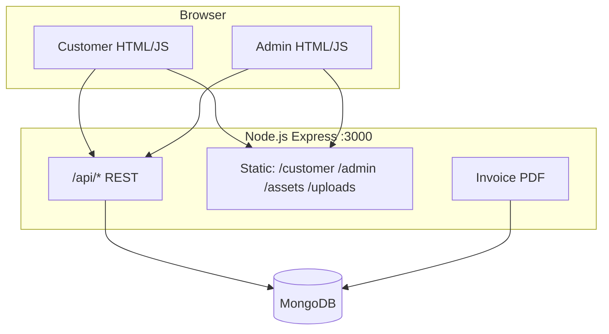

# A & S Traders — Full Stack Web Application

**Sanitary ware & fittings e-commerce** for a Multan-based retail shop.  
Brands: Faisal, Sonex, Porta, Dadex, Master, and more.

Built for **FSWD (Full Stack Web Development)** — customer storefront, admin dashboard, REST API, and MongoDB.

> **Run the app only through the backend:** [http://localhost:3000](http://localhost:3000)  
> Do **not** use VS Code Live Server. Static pages call `/api/*` on the same origin.

---

## Table of contents

1. [Overview](#overview)
2. [Team](#team-5-members)
3. [Features](#features)
4. [Architecture](#architecture)
5. [Tech stack](#tech-stack)
6. [Prerequisites](#prerequisites)
7. [Installation & run](#installation--run)
8. [Environment variables](#environment-variables)
9. [Demo accounts & URLs](#demo-accounts--urls)
10. [Project structure](#project-structure)
11. [Database models](#database-models)
12. [API reference](#api-reference)
13. [User flows (demo / viva)](#user-flows-demo--viva)
14. [Validation & security](#validation--security)
15. [npm scripts](#npm-scripts-backend)
16. [Testing checklist](#testing-checklist)
17. [Troubleshooting](#troubleshooting)
18. [Deployment notes](#deployment-notes)
19. [Optional React admin](#optional-react-admin)

---

## Overview

A & S Traders is a complete shop management system:

| Role | What they do |
|------|----------------|
| **Customer** | Browse catalog, cart, checkout, track orders, upload payment proof |
| **Admin (reception)** | Manage inventory, accept orders, confirm payments, generate invoices, walk-in billing |
| **Delivery staff** | Report COD cash collection via a simple public page |

The backend serves both the **customer site** (`/customer`) and **admin panel** (`/admin`) as static files, plus a JSON API under `/api`.

---

## Team (5 members)

| # | Name | Role | Main contribution |
|---|------|------|-------------------|
| 1 | _Your name_ | Customer frontend | Shop, cart, checkout, login/register, track order, my orders, legal pages |
| 2 | _Your name_ | Admin frontend | Dashboard, orders, inventory, billing, customers, account settings |
| 3 | _Your name_ | Backend & API | Express routes, JWT auth, orders/invoices, PDF generation, file uploads |
| 4 | _Your name_ | Database | MongoDB models, seed data, migrations, pricing logic |
| 5 | _Your name_ | QA & integration | End-to-end testing, payment/COD flows, README, demo script |

_Replace placeholder names before submission._

---

## Features

### Customer website (`/customer`)

| Module | Details |
|--------|---------|
| **Home** | Hero, featured products, store contact, payment info |
| **Shop** | Browse catalog, filter by brand/category, search, sale badges, view full collection |
| **Cart & checkout** | Quantity controls, delivery form, Rs. 1,200 online delivery fee |
| **Pricing** | List price + sale discount shown correctly (no double discount) |
| **Payments** | COD, bank transfer, JazzCash, Easypaisa (chip-style selector) |
| **Payment proof** | Customer uploads screenshot after prepaid checkout |
| **Account** | Register, login, JWT session, sign-out dropdown when logged in |
| **My orders** | Signed-in purchase history |
| **Track order** | Own orders when logged in; guests use order ID + checkout email |
| **COD report** | `/customer/collect-cod.html` — delivery staff reports cash collected |
| **Legal** | [Terms of Service](customer/terms.html) and [Privacy Policy](customer/privacy.html) with register checkbox links |
| **Validation** | Email, password rules, Pakistan mobile (`03XXXXXXXXX`), checkout fields |

### Admin panel (`/admin`)

| Module | Details |
|--------|---------|
| **Dashboard** | Stat cards (orders, revenue, low stock, pending payments) |
| **Inventory** | Add/edit/delete products, stock, discounts, images, low-stock alerts |
| **Orders** | Accept/reject, delivery status workflow, filters (status, payment, method, COD awaiting) |
| **Payment** | View customer-uploaded proof → **Confirm payment received** (no admin upload) |
| **COD** | Delivery reports cash → admin confirms → order marked paid |
| **Invoices** | Generate from online order; walk-in invoices from Billing |
| **PDF** | Download invoice/delivery bill (PAID/UNPAID badge, left-aligned layout) |
| **Trade discount** | Manual PKR discount on invoice total (not per-product) |
| **Billing** | Create walk-in invoices, mark paid, adjust discount, download PDF |
| **Customers** | Profiles, order history, block/unblock |
| **My account** | Admin profile, bank/JazzCash/Easypaisa settings, change password |

**Note:** Tax line is hidden in the UI — prices are treated as **tax-inclusive** (typical for small local shops).

### Backend

- REST API with **MongoDB** (Mongoose)
- Separate **admin JWT** and **customer JWT**
- Server-side validation for products, orders, invoices, auth
- Invoice PDF via **PDFKit**
- Payment proof images saved under `/uploads/payment-proofs/`
- Product images under `/assets/images/products/`

---

## Architecture



**Order lifecycle (online):**

```
pending → confirmed → shipped → delivered
              ↘ cancelled
```

**Payment (prepaid):** `unpaid` → customer uploads proof → admin confirms → `paid`  
**Payment (COD):** `unpaid` → delivery reports cash → admin confirms → `paid`

---

## Tech stack

| Layer | Technology |
|-------|------------|
| Customer UI | HTML5, CSS3, Bootstrap 5, vanilla JavaScript |
| Admin UI | HTML5, CSS3, Bootstrap 5, vanilla JavaScript |
| Backend | Node.js 18+, Express 4 |
| Database | MongoDB (local or Atlas) |
| Auth | bcryptjs, JSON Web Tokens |
| PDF | PDFKit |
| Config | dotenv, CORS |

---

## Prerequisites

- [Node.js](https://nodejs.org/) **18+** (LTS recommended)
- [MongoDB](https://www.mongodb.com/try/download/community) running locally **or** [MongoDB Atlas](https://www.mongodb.com/cloud/atlas) connection string
- A modern browser (Chrome, Edge, Firefox)

---

## Installation & run

### 1. Open the backend folder

```powershell
cd "fswd project\backend"
```

_(Adjust path if your folder name differs.)_

### 2. Install dependencies

```bash
npm install
```

### 3. Create environment file

**Windows:**

```powershell
copy .env.example .env
```

**macOS / Linux:**

```bash
cp .env.example .env
```

Edit `.env` — see [Environment variables](#environment-variables) below.

### 4. Seed demo data

```bash
npm run seed
```

This clears old demo data and creates admin, demo customer, products, sample orders, and invoices.

### 5. Start the server

```bash
npm start
```

Development with auto-restart on file changes:

```bash
npm run dev
```

### 6. Open in browser

| Page | URL |
|------|-----|
| Customer home | http://localhost:3000/customer/index.html |
| Shop | http://localhost:3000/customer/shop.html |
| Admin login | http://localhost:3000/admin/login.html |
| API health | http://localhost:3000/api/health |

Root `/` redirects to the customer home page.

---

## Environment variables

| Variable | Required | Description |
|----------|----------|-------------|
| `PORT` | No | Server port (default `3000`) |
| `MONGODB_URI` | Yes | MongoDB connection string |
| `JWT_SECRET` | Yes | Long random string for signing tokens |
| `ADMIN_EMAIL` | No | Seed admin email (default `admin@astraders.pk`) |
| `ADMIN_PASSWORD` | No | Seed admin password (default `admin123`) |
| `ADMIN_NAME` | No | Admin display name (default `Asim`) |
| `ADMIN_PHONE` | No | Shop phone for seed/contact |

**Example `.env`:**

```env
PORT=3000
MONGODB_URI=mongodb://127.0.0.1:27017/as-traders
JWT_SECRET=your-long-random-secret-here
ADMIN_EMAIL=admin@astraders.pk
ADMIN_PASSWORD=admin123
ADMIN_NAME=Asim
ADMIN_PHONE=03001234567
```

Bank/wallet display text for customers can also be updated in **Admin → My account** (saved in MongoDB) or in `assets/js/payment-info.js` for defaults.

---

## Demo accounts & URLs

### Login credentials

| Role | Email | Password | Notes |
|------|-------|----------|-------|
| **Admin** | `admin@astraders.pk` | `admin123` | Full dashboard access |
| **Customer** | `customer@test.com` | `customer123` | Pre-seeded demo account |

Additional customers may exist after registration (e.g. during testing).

### Customer pages

| Page | Path |
|------|------|
| Home | `/customer/index.html` |
| Shop | `/customer/shop.html` |
| Cart | `/customer/cart.html` |
| Login / Register | `/customer/login.html` |
| My orders | `/customer/my-orders.html` |
| Track order | `/customer/track-order.html` |
| COD collection report | `/customer/collect-cod.html` |
| Terms of Service | `/customer/terms.html` |
| Privacy Policy | `/customer/privacy.html` |

### Admin pages

| Page | Path |
|------|------|
| Login | `/admin/login.html` |
| Dashboard | `/admin/index.html` |
| Inventory | `/admin/inventory.html` |
| Orders | `/admin/orders.html` |
| Billing | `/admin/billing.html` |
| Customers | `/admin/customers.html` |
| My account | `/admin/account.html` |

---

## Project structure

```
fswd project/
├── README.md                      ← This file
│
├── customer/                      ← Customer-facing HTML pages
│   ├── index.html                 ← Home
│   ├── shop.html                  ← Product catalog
│   ├── cart.html                  ← Cart & checkout
│   ├── login.html                 ← Sign in / Register
│   ├── my-orders.html
│   ├── track-order.html
│   ├── collect-cod.html           ← Delivery COD report
│   ├── terms.html
│   └── privacy.html
│
├── admin/                         ← Admin dashboard (HTML + JS)
│   ├── index.html                 ← Dashboard
│   ├── inventory.html
│   ├── orders.html
│   ├── billing.html
│   ├── customers.html
│   ├── account.html
│   ├── login.html
│   └── js/
│       ├── admin-api.js           ← API helpers + JWT
│       ├── admin-orders.js
│       ├── admin-inventory.js
│       ├── admin-billing.js
│       ├── admin-customers.js
│       └── admin-account.js
│
├── assets/
│   ├── css/
│   │   ├── customer.css
│   │   └── admin.css
│   ├── js/
│   │   ├── customer-common.js     ← Cart, auth UI, toasts
│   │   ├── customer-auth.js       ← Login/register validation
│   │   ├── shop-page.js
│   │   ├── cart-page.js
│   │   ├── checkout-validation.js
│   │   ├── phone-validation.js    ← Pakistan mobile (shared)
│   │   ├── product-pricing.js
│   │   ├── payment-info.js
│   │   ├── payment-proof.js
│   │   └── ...
│   └── images/
│       └── products/              ← Product photos
│
├── uploads/
│   └── payment-proofs/            ← Customer payment screenshots
│
└── backend/
    ├── server.js                  ← Entry point
    ├── db.js                      ← MongoDB connection
    ├── seed.js                    ← Demo data
    ├── package.json
    ├── .env.example
    ├── models/
    │   ├── Admin.js
    │   ├── Customer.js
    │   ├── Product.js
    │   ├── Order.js
    │   └── Invoice.js
    ├── routes/
    │   ├── auth.js                ← Admin auth & profile
    │   ├── products.js            ← Admin products CRUD
    │   ├── orders.js              ← Admin orders
    │   ├── invoices.js            ← Billing & PDF
    │   ├── customers.js           ← Admin customer list
    │   ├── dashboard.js
    │   ├── publicProducts.js      ← Shop catalog (public)
    │   ├── publicOrders.js        ← Checkout, track, COD (public)
    │   ├── customerAuth.js        ← Register/login (public)
    │   └── publicContact.js       ← Store phone/email
    ├── middleware/
    │   ├── requireAdmin.js
    │   ├── requireCustomer.js
    │   ├── optionalCustomer.js
    │   └── trackOrderAuth.js
    └── utils/
        ├── validateCustomerAuth.js
        ├── validateDelivery.js
        ├── validateInvoice.js
        ├── validateProduct.js
        ├── invoicePdf.js
        ├── orderInvoice.js
        ├── savePaymentProof.js
        ├── saveProductImage.js
        └── ...
```

---

## Database models

### Product

- SKU, name, category, brand, color, description  
- `price`, `discountPercent`, `finalPrice` (auto-calculated on save)  
- `stock`, `reorderLevel`, `location`, `imageUrl`  
- Virtual `isLowStock` when stock ≤ reorder level  

### Customer

- firstName, lastName, email (unique), phone, city, streetAddress  
- bcrypt password hash, `isBlocked` flag  

### Order

- `orderNumber` (e.g. `CR-2026-xxxxx`), `source` (`online` | `walk-in`)  
- Customer details, delivery address, line items  
- `subtotal`, `deliveryFee`, `amount`  
- `paymentMethod`: `cod` | `bank_transfer` | `jazzcash` | `easypaisa`  
- `status`: pending → confirmed → shipped → delivered (or cancelled)  
- `paymentStatus`: unpaid | paid | partial  
- `paymentProofUrl`, COD report fields, linked `invoiceId`  

### Invoice

- `invoiceNumber` (e.g. `INV-260605-271`)  
- `source`: online (from order) or walk-in  
- Line items, subtotal, deliveryFee, **trade discount**, total  
- `paymentMethod`, `status` (pending | paid | overdue)  

### Admin

- name, email, phone, password  
- `paymentSettings`: bank name, account, IBAN, JazzCash, Easypaisa, notes  

---

## API reference

All admin routes (except login) require header:  
`Authorization: Bearer <admin_token>`

Customer protected routes require:  
`Authorization: Bearer <customer_token>`

### Health

| Method | Endpoint | Auth | Description |
|--------|----------|------|-------------|
| GET | `/api/health` | — | Server + DB status |

### Public — products & contact

| Method | Endpoint | Description |
|--------|----------|-------------|
| GET | `/api/public/products` | List products (shop) |
| GET | `/api/public/products/:id` | Single product |
| GET | `/api/public/products/categories/list` | Categories |
| GET | `/api/public/contact` | Store phone & email |
| GET | `/api/public/store-config.js` | JS config for contact |

### Public — customers

| Method | Endpoint | Description |
|--------|----------|-------------|
| POST | `/api/public/customers/register` | Create account |
| POST | `/api/public/customers/login` | Customer login |
| GET | `/api/public/customers/me` | Current user (token) |
| GET | `/api/public/customers/me/orders` | My orders (token) |

### Public — orders

| Method | Endpoint | Description |
|--------|----------|-------------|
| POST | `/api/public/orders` | Place checkout order |
| GET | `/api/public/orders/track/:orderNumber` | Track order |
| POST | `/api/public/orders/payment-proof` | Upload payment screenshot |
| POST | `/api/public/orders/cod-cash-collected` | Delivery COD report |

### Admin — auth & profile

| Method | Endpoint | Description |
|--------|----------|-------------|
| POST | `/api/auth/login` | Admin login |
| GET | `/api/auth/me` | Current admin |
| PATCH | `/api/auth/profile` | Update name, email, phone |
| PATCH | `/api/auth/payment-settings` | Bank / wallet details |
| PATCH | `/api/auth/password` | Change password |

### Admin — products

| Method | Endpoint | Description |
|--------|----------|-------------|
| GET | `/api/products` | List (filters, search) |
| GET | `/api/products/:id` | Single product |
| POST | `/api/products` | Create |
| PUT | `/api/products/:id` | Update |
| PATCH | `/api/products/:id/stock` | Adjust stock |
| DELETE | `/api/products/:id` | Delete |
| POST | `/api/products/upload-image` | Upload product image |

### Admin — orders

| Method | Endpoint | Description |
|--------|----------|-------------|
| GET | `/api/orders` | List with filters |
| GET | `/api/orders/:id` | Order detail |
| PATCH | `/api/orders/:id/accept` | Accept order |
| PATCH | `/api/orders/:id/reject` | Reject with reason |
| PATCH | `/api/orders/:id/status` | Update delivery status |
| PATCH | `/api/orders/:id/payment` | Mark paid / partial |
| POST | `/api/orders/:id/generate-invoice` | Create invoice from order |
| PATCH | `/api/orders/:id/confirm-cod-payment` | Confirm COD collected |
| GET | `/api/orders/:id/invoice/pdf` | Download order invoice PDF |

### Admin — invoices (billing)

| Method | Endpoint | Description |
|--------|----------|-------------|
| GET | `/api/invoices` | List invoices |
| GET | `/api/invoices/:id` | Invoice detail |
| POST | `/api/invoices` | Create walk-in invoice |
| PATCH | `/api/invoices/:id/discount` | Adjust trade discount |
| PATCH | `/api/invoices/:id/pay` | Mark invoice paid |
| GET | `/api/invoices/:id/pdf` | Download PDF |

### Admin — customers & dashboard

| Method | Endpoint | Description |
|--------|----------|-------------|
| GET | `/api/customers` | Customer list |
| GET | `/api/customers/:id` | Profile + orders |
| PATCH | `/api/customers/:id/block` | Block / unblock |
| GET | `/api/dashboard/stats` | Dashboard numbers |

---

## User flows (demo / viva)

### A. Online order — bank transfer

1. **Customer:** Shop → add items → Cart → fill delivery form → choose **Bank transfer** → Place order.  
2. Note the **order ID** (`CR-2026-xxxxx`).  
3. On success screen, **upload payment screenshot**.  
4. **Admin:** Orders → open order → view proof → **Confirm payment received**.  
5. **Accept** order → update status (confirmed → shipped → delivered).  
6. **Generate invoice** → **Download PDF** (shows PAID).

### B. Online order — COD

1. **Customer:** Checkout with **Cash on delivery**.  
2. **Admin:** Accept order → **Generate invoice** → Download PDF (**UNPAID** badge) → attach to parcel.  
3. **Delivery:** Open `/customer/collect-cod.html` → enter order ID + **phone last 4 digits**.  
4. **Admin:** Order shows COD reported → **Confirm payment received** → PDF now **PAID**.

### C. Walk-in sale (billing)

1. **Admin:** Billing → **Create invoice** → add customer name, phone, line items.  
2. Optional **trade discount** on total.  
3. **Mark as paid** → **Download PDF**.

### D. Customer account

1. Register with Terms + Privacy checkbox (links open in new tab).  
2. Login → name appears in navbar dropdown → **My orders** / **Sign out**.  
3. **Track order:** logged-in users see only their orders; guests need order ID + email.

### E. Inventory

1. Add product with SKU, price, discount %, stock, image.  
2. Low-stock items flagged on dashboard and inventory list.  
3. Shop reflects sale prices and stock availability.

---

## Validation & security

| Area | Implementation |
|------|----------------|
| **Passwords** | Min 8 chars, special character; bcrypt hashing |
| **Pakistan phone** | `03XXXXXXXXX`, `+92`, or `92` formats; client + server |
| **Checkout** | Required delivery fields, phone, email format |
| **Invoices** | Server validates items, discount ≤ total, prices from DB |
| **JWT** | Separate tokens for admin and customer |
| **Track order** | Logged-in users cannot view others’ orders |
| **Order access** | Guest track requires matching checkout email |
| **Blocked customers** | Cannot log in when `isBlocked` is true |

---

## npm scripts (backend)

| Command | Purpose |
|---------|---------|
| `npm start` | Run API + static files on port 3000 |
| `npm run dev` | Start with Node `--watch` (auto-restart) |
| `npm run seed` | Load demo admin, customer, products, orders |
| `npm run seed-accessories` | Add accessory products |
| `npm run update-images` | Refresh product image paths in DB |
| `npm run migrate-pricing` | Fix product discount pricing |
| `npm run migrate-orders` | Normalize legacy order statuses |
| `npm run migrate-source` | Migrate customer source fields |
| `npm run fix-orders` | Repair order line items |
| `npm run test-admin` | Quick admin API smoke test |
| `npm run react:dev` | Optional React admin (Vite) |
| `npm run react:build` | Build optional React admin |

---

## Testing checklist

Use this before demo or submission:

- [ ] Server starts; `/api/health` returns `ok: true`
- [ ] Shop loads products; filters and search work
- [ ] Add to cart; quantities update; sale savings display correctly
- [ ] Register new customer (terms checkbox + phone validation)
- [ ] Login / logout; dropdown shows first name
- [ ] Checkout (bank transfer) + upload payment proof
- [ ] Checkout (COD) completes
- [ ] Admin: login, view dashboard stats
- [ ] Admin: accept/reject order, update delivery status
- [ ] Admin: confirm payment from customer screenshot
- [ ] Admin: generate invoice + download PDF
- [ ] Admin: create walk-in invoice + trade discount
- [ ] Admin: inventory CRUD + low stock
- [ ] Track order (guest + logged-in)
- [ ] COD collect page reports cash
- [ ] Terms & Privacy pages open from register + footer

---

## Troubleshooting

| Problem | Solution |
|---------|----------|
| Products / login not working | Use **http://localhost:3000**, not Live Server |
| `MongoDB connection error` | Start MongoDB service or fix `MONGODB_URI` in `.env` |
| Old UI after code changes | Hard refresh: **Ctrl + Shift + R** |
| Port 3000 in use | Change `PORT` in `.env` or stop the other process |
| Payment screenshot missing | Ensure `uploads/payment-proofs/` exists; restart server |
| Invoice PDF old layout | Restart backend after `invoicePdf.js` changes |
| `npm run seed` deleted my data | Seed **clears** demo collections — back up real data first |
| Images show placeholder | Run `npm run update-images`; check `/assets/images/products/` |

---

## Deployment notes

For a real deployable site:

1. Set strong `JWT_SECRET` and production `MONGODB_URI` (Atlas).  
2. Run behind HTTPS (e.g. Render, Railway, VPS + nginx).  
3. Update admin payment settings and store contact in **My account**.  
4. Keep **Terms** and **Privacy** pages linked from register and footer.  
5. Do not commit `.env` or real credentials to Git.  
6. Ensure `uploads/` is writable on the server for payment proofs.

---

## Optional React admin

A separate React scaffold exists under `backend/react-admin/`.  
The **main project uses the HTML admin panel** in `/admin/`.

```bash
cd backend/react-admin
npm install
npm run dev
```

Vite dev server: http://localhost:5173 (proxies API to port 3000).

---

## Academic note

This project demonstrates:

- Multi-role authentication (admin + customer)  
- CRUD for products and customers  
- Full order lifecycle with payment tracking  
- Invoicing, PDF generation, and walk-in billing  
- File upload (payment proof, product images)  
- Real shop workflows: COD, bank transfer, delivery tracking  
- Form validation (client + server) and basic security  

For submission: update the **team table**, attach screenshots, and align your report/viva with each member’s module.

---

**A & S Traders** · Sanitary ware & fittings · Multan branch  
FSWD Project · 2026
